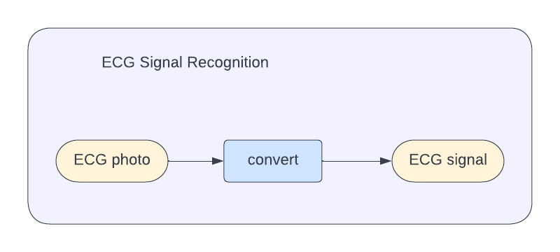
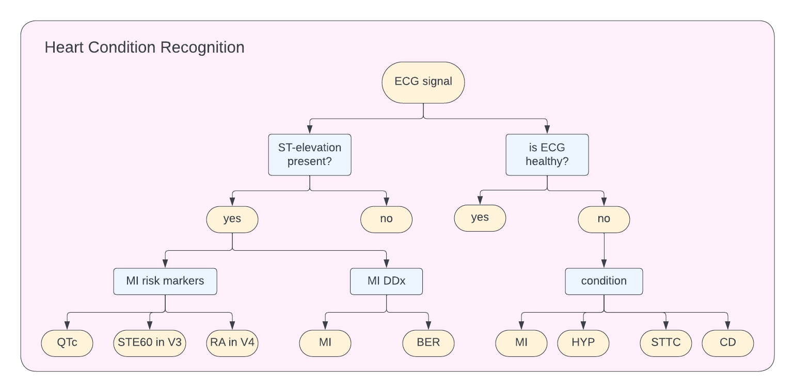

# ECG Recognition Library
This repository contains ECG Recognition Library - an open-source library for assisting in diagnostics of heart conditions from ECG. This library provides functionality of heart condition detection, differential diagnostics, and risk markers evaluation. The library handles ECGs in both formats, as signal or as a photo.

## Project Description

### ECG Features
ECG Recognition Library provides tools for diagnosistcs of several conditions:
* MI (Myocardial Infarction)
* BER (Benign Early Repolarisation)
* HYP (Hypertrophy)
* STTC (ST/T Change)
* CD (Conduction Disturbance)

Main features implemented in the library
1. Recognition of ECG signal from a photo of printed ECG
1. Detection of ST-elevation
1. MI risk markers evaluation
1. MI/BER differential diagnosis
1. Health check for MI, HYP, STTC, CD

Thus compared to other frameworks, ECG Recognition Library:
* Handles ECGs provised as a signal as well as an image
* Provides a range of functionality useful for MI diagnostics
* Provides health checks for several conditions




Details of [implemented methods](docs/models.md).

### Data Requirement
* Required ECG frequency: 500 Hz
* Required length: ≥ 5s

Additional image requirement:
* Image should contain only ECG
    * no background
    * no foreign objects
* Each image should contain only one lead

## Installation
Requirements: Python 3.7

1. [optional] create Python environment, e.g.
    ```
    $ conda create -n ECG python=3.7
    $ conda activate ECG
    ```
1. install requirements from [requirements.txt](requirements.txt)
    ```
    $ pip install -r requirements.txt
    ```
1. install the library as a package
    ```
    $ python -m pip install git+ssh://git@github.com/aimclub/ECG
    ```

## Development
### Environment
Requirements: Python 3.7
1. [optional] create Python environment, e.g.
    ```
    $ conda create -n ECG python=3.7
    $ conda activate ECG
    ```
1. clone repository and install all requirements
    ```
    $ git clone git@github.com:aimclub/ECG.git
    $ cd ECG
    $ pip install -r requirements.txt
    ```
1. run tests
    ```
    $ pytest tests/unit_tests.py
    $ pytest tests/integration_tests.py
    ```
1. fix code style to match PEP8 automatically with autopep8
    ```
    $ pip install autopep8==1.6.0
    $ autopep8 --max-line-length=90 -i -r ECG
    $ autopep8 --max-line-length=90 -i -r tests
    ```
1. check that code style matches PEP8
    ```
    $ pip install pycodestyle==2.8.0
    $ pycodestyle --max-line-length=90 --ignore=E266 ECG
    $ pycodestyle --max-line-length=90 --ignore=E266 tests
    ```
1. build a PyPi package locally
    ```
    $ python3 -m pip install --upgrade build
    $ python3 -m build
    ```

## Documentation
The general description is available [here](https://aimclub.github.io/ECG/).

ECG Recognition Library API is available [here](https://aimclub.github.io/ECG/docs/ECG/api.html)

## Examples & Tutorials
We provide a [tutorial](examples/intro_to_ECG.ipynb) demonstrating suggested usage pipeline

## Contribution Guide
The contribution guide is available in the [repository](./docs/contribution.md).

## Publications about ECG Recognition Library
In Russian:
* Ватьян А.С., Гусарова Н.Ф., Змиевский Д.А., Кабышев М.А., Передреев Д.А., Полевая Т.А., Татаринова А.А., Томилов И.В.Автоматизированная оценка параметров ЭКГ в условиях пандемии COVID-19. Scientific and Technical Journal of Information Technologies, Mechanics and Optics, 2022, vol. 22, no. 5, in press
* Пчелкин А.Ю., Гусарова Н.Ф. Кроссплатформенная разработка на базе вебтехнологий для поддержки решений в проблемно-ориентированных системах управления // Экономика. Право. Инновации. 2022. № 1. С. 41–47. http://dx.doi.org/10.17586/2713-1874-2022-1-41-47.

## Acknowledgments
### Affiliation


The library was developed in [ITMO University](https://en.itmo.ru/).

### Developers
* A. Vatyan - team leader
* N. Gusarova - chief scientific advisor
* T. Polevaya
* D. Zmievsky
* D. Peredreev
* M. Kabyshev

## Contacts
* Alexandra Vatyan alexvatyan@gmail.com for collaboration suggestions
* Tatyana Polevaya tpolevaya@itmo.ru for technical questions
