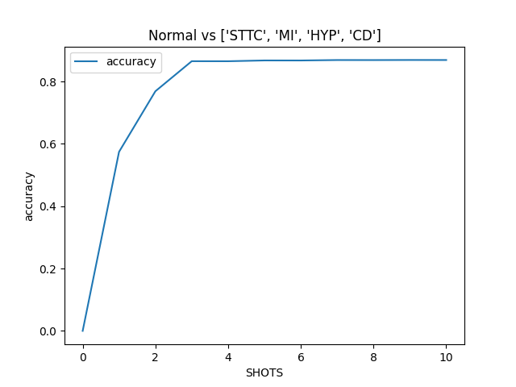

## Implemented methods

### Convert images to signal
First step is preprocessing. An image is auto-rotated so that grid lines are orthogonal to the edges of the image. The algorithm searches for all lines in the image and calculates the angle of their inclination to rotate the picture. Then the RGB-format image is converted to grayscale for further work.

Second step is grid detection. Image is binarized and grid lines are separated from the signal using adaptive thresholding. After that, the algorithm evaluates the scale with the pixel-counting approach - calculating all spacings between grid lines. The scale is used to convert the signal from units of pixels to millimeters.

Third step is signal detection. The grayscale image is binarized using adaptive thresholding with Otsu's method. Then the binarized image is filtered with the median filter to remove noise (separate located pixels).

The final step is signal extraction - the list of all connected pixels of the signal is converted to the 1D array where pixels are scaled and represent amplitudes of the signal. 

### Check ST elevation
The ST segment elevation in lead V3 (STE60) in millivolts is compared to the threshold from medical practice (0.2 mV) [1]. If the ST elevation value exceeds the threshold, it is considered significant. The distribution of normal and elevated ST recordings from the 'China Physiological Signal Challenge 2018' [2] dataset are shown in the normalized density histogram below.

ST elevation is measured from the P-wave offset point at 60 ms after the J point (QRS offset). ECG features are detected using the Neurokit2 library [3].

[1] - Ivan C. Rokos, William J. French, Amal Mattu, Graham Nichol, Michael E. Farkouh, James Reiffel, Gregg W. Stone,
Appropriate Cardiac Cath Lab activation: Optimizing electrocardiogram interpretation and clinical decision-making for acute ST-elevation myocardial infarction,
American Heart Journal, Volume 160, Issue 6, 2010, Pages 995-1003.e8, ISSN 0002-8703, https://doi.org/10.1016/j.ahj.2010.08.011.

[2] - F. F. Liu, C. Y. Liu*, L. N. Zhao, X. Y. Zhang, X. L. Wu, X. Y. Xu, Y. L. Liu, C. Y. Ma, S. S. Wei, Z. Q. He, J. Q. Li and N. Y. Kwee.
An open access database for evaluating the algorithms of ECG rhythm and morphology abnormal detection.
Journal of Medical Imaging and Health Informatics, 2018, 8(7): 1368–1373.

[3] - Makowski, D., Pham, T., Lau, Z. J., Brammer, J. C., Lespinasse, F., Pham, H.,
Schölzel, C., & Chen, S. A. (2021). NeuroKit2: A Python toolbox for neurophysiological signal processing.
Behavior Research Methods, 53(4), 1689–1696. https://doi.org/10.3758/s13428-020-01516-y

### Detect risk markers
Risk markers include ST segment elevation in lead V3 (STE60) in millimeters, the corrected QT interval (QTc) in milliseconds and R-peak amplitude in lead V4 (RA) in millimeters. ST elevation and R-peak amplitude are measured from the PR segment, the P-wave offset point to be precise. ST elevation is measured at 60 ms after the J point (QRS offset). QTc is calculated using the Bazett formula [1]. All ECG features with the exception of the QRS onset and T-wave offset points are detected using the Neurokit2 library [2]. QRS onset points and T-wave offset points are detected using the gradient based approach [3].

[1] - BAZETT, H.C. (1997), AN ANALYSIS OF THE TIME-RELATIONS OF ELECTROCARDIOGRAMS.. 
Annals of Noninvasive Electrocardiology, 2: 177-194. https://doi.org/10.1111/j.1542-474X.1997.tb00325.x

[2] - Makowski, D., Pham, T., Lau, Z. J., Brammer, J. C., Lespinasse, F., Pham, H.,
Schölzel, C., & Chen, S. A. (2021). NeuroKit2: A Python toolbox for neurophysiological signal processing.
Behavior Research Methods, 53(4), 1689–1696. https://doi.org/10.3758/s13428-020-01516-y

[3] - Mazomenos, Evangelos & Chen, Taihai & Acharyya, Amit & Bhattacharya, A. & Rosengarten, James & Maharatna, Koushik. (2012). 
A Time-Domain Morphology and Gradient based algorithm for ECG feature extraction.
2012 IEEE International Conference on Industrial Technology, ICIT 2012, Proceedings. 10.1109/ICIT.2012.6209924. 

### Differensial diagnostics by risk markers
Diagnostic is performed via the modified criterion formula [1]. In the original paper if the value of the equation ([1.196 * ST segment elevation 60 ms after the J point in lead V3 in mm] + [0.059 * QTc in ms] – [0.326 * R-wave amplitude in lead V4 in mm]) is greater than 23.4 the diagnosis is STEMI and if less than or equal to 23.4, the diagnosis is early repolarization.

The original formula was modified by adding a maximal R-peak amplitude parameter and the coefficient values were optimized by a logistic regression model with SGD learning. The original criterion formula has shown the balanced accuracy score of 0.66 on our data, whereas the modified formula has shown the balanced accuracy score of 0.78.

The modified formula is as follows: (2.9 * [STE60 V3 in mm]) + (0.3 * [QTc in ms]) + (-1.7 * np.minimum([RA V4 in mm], 19)) >= 126.9

If tuned == False (default) the original criterion formula is used. Otherwise, if tuned == True the modified formula is used.

[1] - Smith SW, Khalil A, Henry TD, Rosas M, Chang RJ, Heller K, Scharrer E, Ghorashi M, Pearce LA.
Electrocardiographic differentiation of early repolarization from subtle anterior ST-segment elevation myocardial infarction.
Ann Emerg Med. 2012 Jul;60(1):45-56.e2. doi: 10.1016/j.annemergmed.2012.02.015. Epub 2012 Apr 19. PMID: 22520989.

### Diagnostics with neural networks
The ECG Recognition Library also provides neural network (NN) based methods for checking significant ST-elevation and performing differential diagnostics of BER and MI.

All NN-based methods use custom CNN architectures [1]. NN-based diagnostics is explained with GradCAM visualization [2].

[1] - Krizhevsky, Alex & Sutskever, Ilya & Hinton, Geoffrey. (2012). ImageNet Classification with Deep Convolutional Neural Networks. Neural Information Processing Systems. 25. 10.1145/3065386. 

[2] - R. R. Selvaraju, M. Cogswell, A. Das, R. Vedantam, D. Parikh and D. Batra, "Grad-CAM: Visual Explanations from Deep Networks via Gradient-Based Localization," 2017 IEEE International Conference on Computer Vision (ICCV), 2017, pp. 618-626, doi: 10.1109/ICCV.2017.74.

### ECG embedding classification
ECG classification is performed between normal and abnormal classes. The embeddings which are extracted with help of deep convolutional network are classified by k-nearest-neighbour classifier.

The EGG embedding extractor (CNN) was trained using the Siamese networks approach on all classes of the [PTB-XL](https://physionet.org/content/ptb-xl/1.0.1/) dataset. During training, ECG pairs of the form {NORMAL, NORMAL} and {NORMAL, ABNORMAL} were passed through the network, and the resulting distances between their elements were calculated. These distances were provided to loss function called Contrastive Loss, which goal is is to minimize the distance between similar pairs of inputs (NORMAL and NORMAL) while maximizing the distance between dissimilar pairs (NORMAL and ABNORMAL). As a result, the trained embedding extractor is able to compute embeddings of ECGs for both healthy and unhealthy classes of the entire dataset dataset.

Classification is performed with kNN classifier (k=3) on a subset of training data (their embeddings). The subset consists of 7 randomly chosen normal ECG signals and 7 randomly chosen ECG signals with the abnormality of interest.

The greatest improvement in metric performance is observed on a small set of training data. Specifically, 3 samples of each normal and abnormal ECG are already enough to achieve high metrics performance.